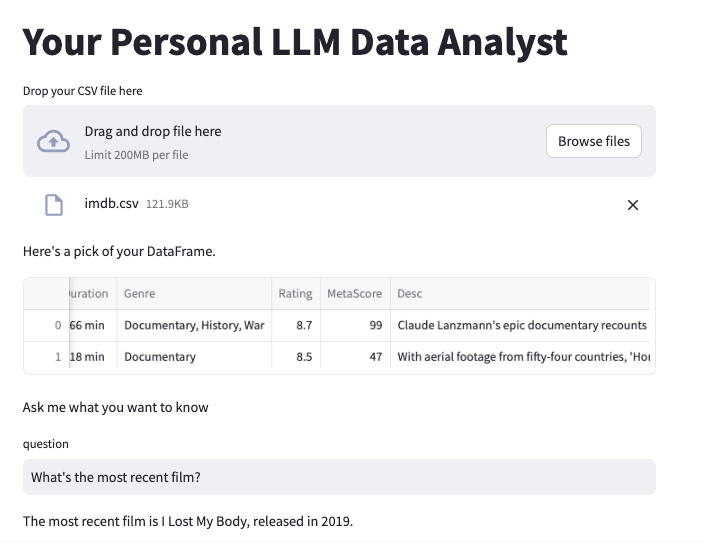

# Personal Data Analyst

Do you want to question your data in plain english?

Well, fear no more! 

Just clone this project, and this dream will become true.

If you like this repository, give it a star ⭐!

## Setup
 You'll need an `OPENAI_API_KEY` inserted in a .env file to use this project.

 You'll also need [Poetry](https://python-poetry.org/). If unsure how to install it, just follow the installation guide.

 ## Running the application
Once you have created the file, just open your terminal and execute:

```python
make run
```

## App overview

The interface for the app is pretty intuitive, and you can use any CSV file you want! 



## Disclaimer

The code and content in this repository utilize OpenAI's  models for generating text-based responses. It's important to note that its responses are generated based on patterns in the data it was trained on, and there may be instances where the generated content is incorrect, inappropriate, or biased. This repository is provided for educational and experimental purposes, and users should exercise caution and critical judgment when interacting with the generated responses.

The maintainers of this repository are not responsible for the accuracy or suitability of the generated content. Any use of the generated content from this repository is at the user's own risk. Additionally, users are encouraged to review and comply with OpenAI's usage policies and guidelines when using the ChatGPT model.

By accessing or using this repository, you agree to these terms and understand the limitations of the technology. If you have any concerns about the content generated by ChatGPT, please proceed with caution and consider seeking human expertise when necessary.


